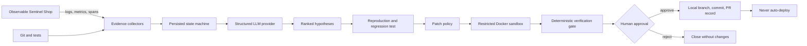

# SentinelOps — Autonomous AI Reliability Engineer

SentinelOps is an evidence-first incident repair agent. It collects observable failure signals, ranks falsifiable hypotheses, proves a regression, proposes a bounded patch, verifies mandatory gates in a restricted sandbox, and stops for human approval before preparing a pull request. It never deploys.

## Problem

Incident response is slowed by fragmented logs, traces, source history, and test output. AI can accelerate the investigation, but an unbounded agent is unsafe. SentinelOps separates probabilistic diagnosis from deterministic policy and verification gates, preserving evidence for every decision.

## Architecture



## Highlights

- FastAPI demo shop with products, cart, checkout, discount codes, regional tax, health, Prometheus metrics, request IDs, JSON logs, stack traces, and spans.
- Persisted, validated 20-state workflow and complete audit timeline.
- Ranked evidence-for/evidence-against hypotheses with validated JSON contracts.
- Deterministic mock provider; optional OpenAI-compatible boundary; explicit Gemini adapter placeholder.
- Patch limits, protected paths, assertion/test protections, command allowlist, and network-disabled Docker runner.
- Six-check verification view and approval-only draft PR record.
- Responsive React operations dashboard with live state rail, charts, investigation evidence, diff, and approval control.
- Three incidents; the checkout failure has the full repair path, while latency and missing-secret cases are diagnosis/escalation demonstrations.

## Quick start (local or GitHub Codespaces)

Prerequisites: Python 3.12, Node 22, Docker with Compose, and Git. Codespaces installs these through `.devcontainer/devcontainer.json`.

```bash
cp .env.example .env
make setup
make demo
```

Open the forwarded dashboard on port `5173`, API docs on port `8000/docs`, and demo shop docs on port `8001/docs`. Then:

```bash
make seed
python scripts/generate_traffic.py
```

In the dashboard, advance the incident through evidence, hypotheses, reproduction, patch, and verification; approval is a separate required action.

## Exact GitHub Codespaces setup

1. Open [the SentinelOps repository](https://github.com/Janicebenita/SentinelOps).
2. Select **Code → Codespaces → Create codespace on main**.
3. Wait for `postCreateCommand` to install Python and frontend dependencies.
4. In the Codespaces terminal run `cp .env.example .env` (skip this if `.env` exists).
5. Run `make demo`. This builds the restricted sandbox image, starts all three services, waits for health, and keeps them supervised.
6. Open the automatically forwarded **SentinelOps Dashboard** port `5173`. API OpenAPI is port `8000/docs`; Sentinel Shop OpenAPI is port `8001/docs`.
7. To verify the complete seeded repair, open a second terminal and run `python scripts/validate_e2e.py`.

Codespaces forwards ports `5173`, `8000`, and `8001`. Mock mode is the default; no paid model key is required. The Docker-in-Docker feature is necessary because reproduction and patch verification fail closed unless the restricted sandbox is available.

## Configuration

`LLM_PROVIDER=mock` is the default and needs no paid API. For an OpenAI-compatible endpoint set `LLM_PROVIDER=openai`, `OPENAI_API_KEY`, `OPENAI_BASE_URL`, and `OPENAI_MODEL`. `GEMINI_API_KEY` is reserved for the optional adapter. Do not commit `.env`.

## Quality commands

```bash
make test
make lint
make typecheck
make security
```

See [API](docs/api.md), [architecture](docs/architecture.md), [safety model](docs/safety.md), and the [live demo script](docs/demo-script.md).

## Known limitations

- The hackathon PR is a local, simulated record by default; GitHub PR creation is optional and credential-dependent.
- SQLite is single-instance development storage; deploy PostgreSQL for multiple workers.
- Only Incident 1 has a complete repair path.
- The Gemini adapter is intentionally not bundled; mock mode is the supported zero-key demo.
- The candidate-patch workspace/commit path is intentionally conservative and must not be used as production deployment automation.

## Roadmap

Real OpenTelemetry collector storage, PostgreSQL migrations, GitHub Checks integration, ephemeral Kubernetes sandbox jobs, more repair templates, and post-merge observation without automatic deployment.

## Screenshots

Dashboard overview, ranked hypotheses, verification gate, and approval screen placeholders are under `docs/screenshots/` for hackathon capture.
