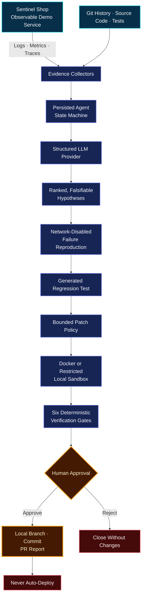

<h1 align="center">🛡️ SentinelOps</h1>

<h3 align="center">Autonomous AI Reliability Engineer</h3>

<p align="center">
  Evidence-first incident investigation, safe failure reproduction, bounded patch generation,<br/>
  deterministic verification, and human-approved repair — with no automatic deployment.
</p>

<p align="center">
  <a href="https://janicebenita-sentinelops.onrender.com/"><strong>🚀 Launch Live Demo</strong></a>
  &nbsp;•&nbsp;
  <a href="docs/sentinelops-complete-demo-with-approval.mp4"><strong>▶ Watch Demo Video</strong></a>
  &nbsp;•&nbsp;
  <a href="docs/architecture.md"><strong>🏗️ Architecture</strong></a>
  &nbsp;•&nbsp;
  <a href="docs/safety.md"><strong>🔐 Safety Model</strong></a>
</p>

<p align="center">
  
</p>

<p align="center">
  
  
  
  
  
</p>

<p align="center">
  
  
  
  
</p>

> **Hosted on Render:** free-tier services may take about 50 seconds to wake after inactivity. The demo runs in deterministic mock mode and requires no paid AI key.

---

## 🏆 Project Submission

### Safe Autonomous Incident Repair with Human Approval

Production incidents force engineers to correlate fragmented logs, metrics, traces, source history, and test results under time pressure. Conventional coding agents can move quickly, but an unbounded agent can misdiagnose the failure, modify unrelated files, skip verification, or deploy an unsafe change.

**SentinelOps** solves this by separating probabilistic diagnosis from deterministic safety policy. It gathers evidence, ranks falsifiable hypotheses, proves the regression, proposes a tightly bounded candidate patch, runs mandatory quality gates in an isolated sandbox, and stops for explicit human approval before preparing a pull-request report.

---

## 🚀 Overview

SentinelOps is an autonomous reliability engineer designed for SRE, platform, and application teams. Every important decision is backed by persisted evidence and recorded on an auditable incident timeline.

It provides:

- 🔭 **Observable demo service** with structured logs, Prometheus metrics, traces, request IDs, health checks, and reproducible seeded failures
- 🧾 **Multi-source evidence collection** across telemetry, Git history, source code, tests, and audit events
- 🧠 **Ranked hypotheses** with explicit evidence for and against every explanation
- 🧪 **Regression-first reproduction** inside a restricted, network-disabled sandbox
- 🩹 **Bounded patch generation** protected by path, diff-size, assertion, and command policies
- ✅ **Six deterministic verification gates** covering regression, unit, integration, Ruff, MyPy, and Bandit
- 👤 **Mandatory human approval** before a local branch, commit, or PR report can be prepared
- 📜 **Persisted audit timeline** for every transition, artifact, decision, and approval event
- 🚫 **No automatic deployment** by design

---

## ✨ Why SentinelOps Is Different

| Capability | SentinelOps approach |
|---|---|
| Diagnosis | Ranked, falsifiable hypotheses grounded in collected evidence |
| Reproduction | Failure must be reproduced before a repair is considered |
| Patch safety | Candidate changes are isolated and checked against deterministic policy |
| Verification | All required gates must pass; model confidence cannot override failures |
| Source protection | The original source tree remains unchanged during candidate evaluation |
| Human control | The workflow stops at approval and clearly exposes the proposed diff |
| Accountability | State, evidence, commands, outputs, and approvals are persisted |
| Deployment | SentinelOps never deploys automatically |

---

## ⚡ Quick Start

### Prerequisites

- Python 3.11+
- Node.js 22+
- Git
- Docker recommended, but optional

### Run the complete system

```bash
cp .env.example .env
make setup
make demo
```

Open:

- **SentinelOps dashboard:** http://localhost:5173
- **SentinelOps API docs:** http://localhost:8000/docs
- **Sentinel Shop API docs:** http://localhost:8001/docs

In a second terminal, seed and exercise the repair scenario:

```bash
make seed
python scripts/generate_traffic.py
```

Validate the complete seeded workflow:

```bash
python scripts/validate_e2e.py
```

---

## 🐳 Docker

```bash
docker compose up --build
```

Docker mode runs candidate checks with networking disabled, bounded resources, limited processes, execution timeouts, and a read-only container filesystem.

When Docker is unavailable, SentinelOps selects its restricted Local Sandbox. The fallback copies candidate code into a temporary workspace and accepts only exact predefined test commands through `shell=False` execution.

---

## 🎬 Demo Scenario

The seeded Sentinel Shop incident is a checkout failure triggered by the combination of:

```text
Shipping region: TN
Discount code: SAVE10
Expected symptom: HTTP 500 and an error-rate spike
```

The investigation shows a nullable Tennessee tax rate as the highest-ranked explanation, reproduces the failure offline, generates a regression test, evaluates an isolated one-line candidate fix, and stops at human approval after all checks pass.

### Three-minute demo

[**▶ Watch the complete 3:30 narrated demo with human approval →**](docs/sentinelops-complete-demo-with-approval.mp4)

- **0:00–0:20** Open the healthy dashboard and Sentinel Shop product endpoint.
- **0:20–0:40** Trigger the TN + `SAVE10` checkout and show the HTTP 500/error-rate spike.
- **0:40–1:10** Start Incident 1 and inspect JSON logs, metrics, trace span, Git evidence, and audit events.
- **1:10–1:35** Review ranked hypotheses with evidence for and against the nullable TN tax-rate explanation.
- **1:35–1:55** Reproduce the failure in the network-disabled sandbox and show the regression test failing before the patch.
- **1:55–2:25** Review the isolated one-line diff and run regression, unit, integration, Ruff, MyPy, and Bandit gates.
- **2:25–2:45** Confirm the source tree remains unchanged, every check passes, and the agent stops at human approval.
- **2:45–3:00** Approve, create the PR report, inspect the persisted audit timeline, and reset the demo. Nothing is deployed.

---

## 🧠 Architecture



### Persisted workflow

```text
Incident → Evidence → Hypotheses → Reproduction → Regression
         → Candidate Patch → Verification → Human Approval
         → PR Report or Rejection → Audit Timeline
```

The backend validates a 20-state workflow so transitions cannot be skipped by the model or the UI.

---

## 🛠 Technology Stack

### 🎨 Frontend

<p>
  
  
  
  
  
</p>

- Responsive operations dashboard
- Incident state rail and evidence panels
- Metrics and verification visualizations
- Candidate diff review and approval controls

### ⚙️ Backend and Agent

<p>
  
  
  
  
</p>

- FastAPI orchestration and demo APIs
- Pydantic-validated LLM contracts
- SQLAlchemy persistence for incidents, evidence, artifacts, checks, and audits
- Deterministic mock provider plus an optional OpenAI-compatible boundary

### 🔐 Safety and Quality

<p>
  
  
  
  
  
</p>

- Protected-path and diff-size policy
- Assertion and test-protection rules
- Exact command allowlist
- Network-disabled candidate workspace
- Regression, unit, integration, lint, type, and security gates

---

## 📁 Repository Structure

```text
backend/
  app/
    agent/          # persisted workflow and state model
    api/            # FastAPI incident and approval routes
    llm/            # mock and optional model providers
    models/         # SQLAlchemy entities
    policies/       # protected paths and command allowlist
    schemas/        # validated structured contracts
    services/       # audit and demo seed services
    tools/          # evidence readers, patch tools, sandbox
  tests/

demo_app/
  app/              # observable Sentinel Shop service
  seeded_bugs/      # deterministic incident fixture
  tests/

frontend/
  src/              # React dashboard, charts and approval UI

sandbox/            # isolated candidate execution image
scripts/            # setup, traffic, reset and E2E validation
docs/               # architecture, API, safety and demo guides
data/               # local telemetry and incident fixtures
```

---

## ✅ Quality Commands

```bash
make test
make lint
make typecheck
make security
```

The verification view reports six independent checks:

| Gate | Purpose |
|---|---|
| Regression | Proves the original failure and validates the repair |
| Unit | Protects component behavior |
| Integration | Validates service interactions |
| Ruff | Enforces Python lint rules |
| MyPy | Checks static types |
| Bandit | Scans candidate Python code for security issues |

---

## 🛡️ Safety Behavior

SentinelOps cannot approve its own repair. Model output is advisory until deterministic policy and verification gates accept the candidate.

- The model cannot bypass workflow states.
- Candidate code is evaluated outside the original source tree.
- Docker reproduction runs without network access.
- Arbitrary commands and package installation are rejected.
- Protected paths, tests, and assertions cannot be silently changed.
- Failed or missing gates block approval readiness.
- Every material action is recorded in the audit timeline.
- Human rejection closes the repair without source changes.
- Approval may prepare a PR report, but **nothing is automatically deployed**.

Read the complete [safety model](docs/safety.md) and [documented limitations](docs/limitations.md).

---

## 🌐 Live Demo

| Service | URL |
|---|---|
| 🖥️ SentinelOps Dashboard | https://janicebenita-sentinelops.onrender.com/ |
| 🤖 SentinelOps API | https://janicebenita-sentinelops-api.onrender.com/docs |
| 🛒 Sentinel Shop | https://janicebenita-sentinel-shop.onrender.com/docs |

Deterministic screenshot states are available through `?demoState=healthy`, `incident`, `evidence`, `hypothesis`, `reproduced`, `patch`, `verified`, `approval`, and `completed`.

---

## ⚙️ Configuration

`LLM_PROVIDER=mock` is the default and needs no paid API. For an OpenAI-compatible endpoint, configure:

```env
LLM_PROVIDER=openai
OPENAI_API_KEY=your-key
OPENAI_BASE_URL=https://api.example.com/v1
OPENAI_MODEL=your-model
```

Do not commit `.env` or secrets. `GEMINI_API_KEY` is reserved for the optional adapter.

---

## 🚧 Current Limitations

- SQLite is intended for a single development or demo instance.
- Incident 1 contains the complete automated repair path; the other seeded incidents focus on diagnosis and escalation.
- The default PR artifact is a local, simulated report unless GitHub credentials are explicitly configured.
- The Local Sandbox runs reduced checks; Docker mode provides the complete isolation and six-gate path.
- Render free-tier instances use ephemeral storage and may cold-start after inactivity.

---

## 🔮 Roadmap

- PostgreSQL persistence and multi-worker execution
- Real OpenTelemetry collector storage
- GitHub Checks and richer pull-request integration
- Ephemeral Kubernetes sandbox jobs
- Additional repair templates and incident classes
- Post-merge observation without automatic deployment

---

## 📚 Documentation

| Document | Description |
|---|---|
| [Architecture](docs/architecture.md) | System components and workflow design |
| [API Reference](docs/api.md) | Backend endpoint guide |
| [Safety Model](docs/safety.md) | Deterministic policy and approval boundaries |
| [Demo Script](docs/demo-script.md) | Guided product demonstration |
| [Evaluation](docs/evaluation.md) | Validation and judging evidence |
| [Judge Q&A](docs/judge-qa.md) | Common technical and product questions |
| [Submission Summary](docs/submission-summary.md) | Concise project narrative |

---

<p align="center">
  <strong>🛡️ SentinelOps</strong><br/>
  Evidence first. Verification required. Humans remain in control.
</p>

<p align="center">
  ⭐ Autonomous reliability engineering without autonomous deployment ⭐
</p>
