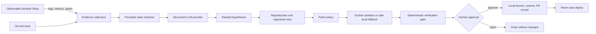

# SentinelOps — Autonomous AI Reliability Engineer

SentinelOps is an evidence-first incident repair agent. It collects observable failure signals, ranks falsifiable hypotheses, proves a regression, proposes a bounded patch, verifies mandatory gates in a restricted sandbox, and stops for human approval before preparing a pull request. It never deploys.

## Problem

Incident response is slowed by fragmented logs, traces, source history, and test output. AI can accelerate the investigation, but an unbounded agent is unsafe. SentinelOps separates probabilistic diagnosis from deterministic policy and verification gates, preserving evidence for every decision.

## Architecture



## Highlights

- FastAPI demo shop with products, cart, checkout, discount codes, regional tax, health, Prometheus metrics, request IDs, JSON logs, stack traces, and spans.
- Persisted, validated 20-state workflow and complete audit timeline.
- Ranked evidence-for/evidence-against hypotheses with validated JSON contracts.
- Deterministic mock provider; optional OpenAI-compatible boundary; explicit Gemini adapter placeholder.
- Patch limits, protected paths, assertion/test protections, and automatic Docker/local sandbox selection.
- Six-check verification view and approval-only draft PR record.
- Responsive React operations dashboard with live state rail, charts, investigation evidence, diff, and approval control.
- Three incidents; the checkout failure has the full repair path, while latency and missing-secret cases are diagnosis/escalation demonstrations.

## Quick start (local or GitHub Codespaces)

Prerequisites: Python 3.12, Node 22, and Git. Docker is recommended but optional.

```bash
cp .env.example .env
make setup
make demo
```

Open the forwarded dashboard on port `5173`, API docs on port `8000/docs`, and demo shop docs on port `8001/docs`. Then:

The Vite server proxies `/api` to the private backend, so only port `5173` needs public visibility in Codespaces.

```bash
make seed
python scripts/generate_traffic.py
```

In the dashboard, advance the incident through evidence, hypotheses, reproduction, patch, and verification; approval is a separate required action.

## Exact GitHub Codespaces setup

1. Open [the SentinelOps repository](https://github.com/Janicebenita/SentinelOps).
2. Select **Code → Codespaces → Create codespace on main**.
3. Wait for the tool verification and `make setup` post-create steps to install Python and frontend dependencies. Existing Codespaces must use **Codespaces: Full Rebuild Container** after this base-image change.
4. In the Codespaces terminal run `cp .env.example .env` (skip this if `.env` exists).
5. Run `make demo`. It installs any missing launch dependencies, selects Docker when available or the safe local fallback, then starts and supervises all three services.
6. Open the automatically forwarded **SentinelOps Dashboard** port `5173`. API OpenAPI is port `8000/docs`; Sentinel Shop OpenAPI is port `8001/docs`.
7. To verify the complete seeded repair, open a second terminal and run `python scripts/validate_e2e.py`.

Codespaces forwards ports `5173`, `8000`, and `8001`. Mock mode is the default; no paid model key or Docker installation is required.

### Sandbox modes

- **Docker Sandbox:** selected automatically when the `docker` executable exists. Candidate checks run with no network, bounded CPU, memory, processes, time, and a read-only container filesystem.
- **Local Sandbox:** selected automatically when Docker is absent, including standard Codespaces. It copies candidate code into a fresh temporary workspace and invokes Python directly with `shell=False`. It accepts only exact, predefined pytest commands; shell fragments, arbitrary Python, package installation, and other commands are rejected. The temporary copy is deleted after every run.

Docker mode runs the complete six-check gate. Local mode runs the regression, unit, and integration pytest gates and clearly records `sandbox_mode=local`; use Docker mode for the stronger Ruff, MyPy, and Bandit candidate-workspace gates.

### Commands and ports

```bash
make setup  # install Python and frontend dependencies
make demo   # auto-select a sandbox and start the complete system
```

| Service | Port | Codespaces behavior |
|---|---:|---|
| SentinelOps Dashboard | 5173 | Opens automatically after startup |
| SentinelOps API | 8000 | Forwarded; OpenAPI at `/docs` |
| Sentinel Shop demo | 8001 | Forwarded; OpenAPI at `/docs` |

Public demo URL: `https://<your-codespace-name>-5173.app.github.dev/`

### Three-minute demo

- **0:00–0:20** Open the healthy dashboard and Sentinel Shop product endpoint.
- **0:20–0:40** Trigger the TN + `SAVE10` checkout and show the HTTP 500/error-rate spike.
- **0:40–1:10** Start Incident 1 and show collected JSON logs, metrics, trace span, Git evidence, and audit events.
- **1:10–1:35** Show the ranked hypotheses; the nullable TN tax-rate explanation ranks first with evidence for and against.
- **1:35–1:55** Reproduce the failure in the network-disabled sandbox and show the generated regression test failing before the patch.
- **1:55–2:25** Review the isolated one-line candidate diff and run regression, unit, integration, Ruff, MyPy, and Bandit gates.
- **2:25–2:45** Show the source tree remained unchanged, every check passed, and the agent stopped at human approval.
- **2:45–3:00** Approve, create the PR report, show the persisted audit timeline, then Reset Demo. State that nothing was deployed.

## Configuration

`LLM_PROVIDER=mock` is the default and needs no paid API. For an OpenAI-compatible endpoint set `LLM_PROVIDER=openai`, `OPENAI_API_KEY`, `OPENAI_BASE_URL`, and `OPENAI_MODEL`. `GEMINI_API_KEY` is reserved for the optional adapter. Do not commit `.env`.

## Quality commands

```bash
make test
make lint
make typecheck
make security
```

See [API](docs/api.md), [architecture](docs/architecture.md), [safety model](docs/safety.md), and the [live demo script](docs/demo-script.md).

## Known limitations

- The hackathon PR is a local, simulated record by default; GitHub PR creation is optional and credential-dependent.
- SQLite is single-instance development storage; deploy PostgreSQL for multiple workers.
- Only Incident 1 has a complete repair path.
- The Gemini adapter is intentionally not bundled; mock mode is the supported zero-key demo.
- The candidate-patch workspace/commit path is intentionally conservative and must not be used as production deployment automation.

## Roadmap

Real OpenTelemetry collector storage, PostgreSQL migrations, GitHub Checks integration, ephemeral Kubernetes sandbox jobs, more repair templates, and post-merge observation without automatic deployment.

## Screenshots

Dashboard overview, ranked hypotheses, verification gate, and approval screen placeholders are under `docs/screenshots/` for hackathon capture.
