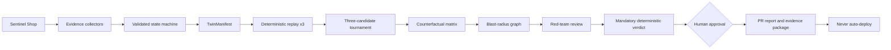

# Architecture

SentinelOps is a modular monolith for the MVP. FastAPI owns the API, SQLAlchemy stores domain and audit records, and an explicit transition graph prevents invalid or skipped stages. Provider output ends at typed Pydantic contracts. Evidence collection, patch inspection, command validation, verification, and approval are deterministic code.

The React client auto-seeds a deterministic empty database, polls persisted state, and renders the same audit facts exposed by the API. Read-only `?demoState=` fixtures provide repeatable screenshots without changing persisted state. The demo application writes JSON Lines and exposes Prometheus-compatible metrics. Codespaces selects Docker when available and otherwise uses the restricted copied-workspace Local Sandbox.

Every displayed explanation follows Observation → Evidence → Hypothesis → Test → Result → Decision. No hidden chain-of-thought is stored or displayed.
# Reliability Digital Twin finale

The original 20-state workflow remains the authority for incident progression. The finale is additive inside reproduction, patch generation, and verification: reproduction creates an immutable `TwinManifest`; patch generation creates three `RepairCandidate` records; verification runs the tournament, counterfactual matrix, blast-radius estimation, evidence links, and red-team review before the existing `AWAITING_APPROVAL` state can be reached.

## Persistence

The extension adds `twin_manifests`, `replay_runs`, `repair_candidates`, `candidate_verifications`, `counterfactual_scenarios`, `scenario_results`, `blast_radius_estimates`, `evidence_links`, `red_team_reviews`, `audit_chain_events`, and `incident_packages`. Structured fields use SQLAlchemy JSON so the zero-migration SQLite demo remains portable to PostgreSQL.

## Deterministic versus probabilistic

- Deterministic: manifest hashing, seeded replay fixtures, command policy, patch policy, gate eligibility, scoring arithmetic, scenario rules, SHA-256 artifact hashes, and chained audit verification.
- Probabilistic or estimated: model-generated hypotheses, confidence labels, static dependency inference, and blast-radius prediction.
- Human judgment: whether a documented assumption is acceptable, whether residual risk fits production policy, and whether to approve or reject.

No LLM directly changes state. API handlers call backend workflow policy, and there is no deployment route.
